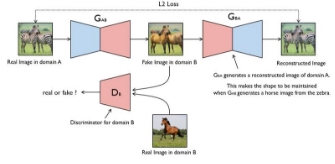
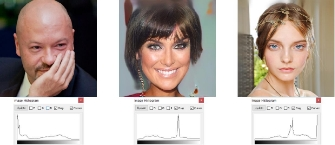

Unmasking DeepFake Visual Content with Generative AI

Mohendra Roy

Department of ICT , School of Technology Pandit Deendayal Energy University      Gandhinagar, India                     mohendra.roy@ieee.org

Abstract—Recent advances in deep learning-based generative models have increased the proliferation of fake media, which has caused severe unrest globally. These generative models can create ultra-realistic images and videos that are almost impossible to differentiate from traditional image and video processing techniques. As a result, there has been a considerable demand for effective fake multimedia detection methods. This paper provides an in-depth review of different approaches to deepfake to understand and exploit counterfeit media content. The available learning techniques for creating and detecting forensic setups have been investigated in this paper as the authenticity and integrity of multimedia content play a significant role in decision- making or providing verdicts. Ultimately, we point out various futuristic technologies that can rejuvenate research to design a full-proof deepfake ecosystem.

Index Terms—Computer vision, deep learning, detection, fake news, generative AI

1. INTRODUCTION

Deepfake creation has evolved dramatically in recent years, and it might be used as fake news to spread disinformation worldwide, which can raise future danger. There are AI- generated images, videos, and audio that have been synthe- sized. More so, using recordings as evidence is becoming the standard in all litigation and criminal justice processes. One early example of content manipulation occurred in 1860 on a portrait of a Southern politician named John Calhoun. His head was replaced with the president of the US, Abraham Lincoln [1]. The manipulation was accomplished by adding (splicing), removing (in-painting), and replicating (copy-move) the ob- jects within or between two images. Suitable post-processing steps such as scaling, rotation, and color correction are ap- plied to improve the visual appearance, scale, and perspective consistency.

In 2017, the firstdeepfake video was discovered [2], placing a celebrity’s face on porn actors. It threatens global security when fake methods can be used to create movies of interna- tional leaders with falsified speeches for fraudulent objectives. In 2018, another example of counterfeit content emerged with its political misuse. A political party in Belgium made a fake video of Donald Trump speaking and urging Belgium to withdraw from the Paris Climate Agreement [1]. It was not the first time a phony video had been used to produce misleading

979-8-3503-2614-7/23/$31.00 ©2023 IEEE

Mehul S Raval

School of Engineering and Applied Science Ahmedabad University

Ahmedabad, India

Corresponding author: mehul.raval@ahduni.edu.in

movies. Tech-savvy political experts predict that there will soon be a new wave of fake news that is convincingly realistic.

Spreading manipulated data is easy, but rectifying the data and combating fake is becoming increasingly challenging. To fight them, we need to understand what they are, how it is created, why, and the possible technologies available to combat them. Fake content has gained momentum on the web with the advancement of accessible deep generative networks. Although articles on the topic are extensive, a conclusive literature survey is relatively sparse. Hence, this study points to the benefits and dangers of deepfake technologies and a few illustrations of current creation and detection techniques. We analyzed several research articles from scholarly repositories, like the Web of Science and Scopus. The study contributes to the nascent literature by imparting a comprehensive review that emerges into an academic debate to fight deepfakes.

The organization of the article is as follows. Starting with the introduction, the study also explains the benefits of such technology, followed by the impact of deep synthesized me- dia. The study then puts forward three sections that review recent developments in generative networks, methods of media forgery, and media forgery detection techniques, followed by a summary of the covered methods and observations. After that, two sections provide a list of available datasets. Finally, the study concludes with implications, limitations, and suggestions for future research.

A. The Benefits of Deepfake Technology

Many sectors, such as gaming and entertainment, educa- tional media, movies, social media and healthcare, material science, criminal forensics, and many business fields, like e- commerce and fashion, can benefit from such technology.

It can be applied in various ways in the film industry. It can assist in creating digital voices aiding the performers with lost voices due to disease, or updating movie footage as a substitute rather than re-shooting it. Moreover, filmmakers may aim to reproduce classic films by featuring long-dead actors, applying artistic expressions with complex face editing and special effects, and upgrading to a professional quality [3]. Such technology can also be used for automatic voice dubbing movies in any language. It can make realistic films

Authorized licensed use limited to: Techno India. Downloaded on May 24,2024 at 10:16:52 UTC from IEEE Xplore.  Restrictions apply. 

979-8-3503-2614-7/23/$31.00 ©2023 IEEE 169

and instructional media with more comprehensive access to a large audience group [3].

In online games and virtual chat environments, deepfakes technology can be employed for improved telepresence, in- cluding realistic-looking and sounding assistants. It can aid in developing better online human interactions and relationships and assist in digital doubles of individuals [4].

Deepfake is also progressing to aid in the social and medical spheres. It can help people to cope with the demise of a loved one by digitally bringing the deceased companion ”back to life” and can bid their final goodbyes. Moreover, using deepfake technology, a person with Alzheimer’s may be assisted to connect with a younger visage. The Generative Adversarial Networks(GANs) technology is also being investi- gated to identify irregularities in X-rays and their potential for producing virtual chemical compounds to speed up materials research and medical discoveries [5].

It can potentially impact in e-commerce and advertising. Business brands can hire ordinary people to model fashion items with models of diverse heights, weights, and skin tones. Deepfakes can be employed to personalize the content and can transform customers into models. The technology can allow virtual fittings of items to see how an item will appear before purchasing it, as well as the generation of customized fashion commercials that change depending on the viewer, weather, and time. Moreover, the technology will allow people to create digital clones of themselves and try on clothes online quickly, have their avatars travel with them across e-stores, and try on a bridal gown or suit in digital form, then virtually experience a wedding venue. AI can also generate excellent artificial voices that can assist companies and merchandise stand out [6].

The technology can be applied in criminal forensics to reconstruct crime scenes digitally. Artificial Intelligence (AI)- Generated synthetic media can assist in rebuilding the scene using inductive and deductive reasoning, taking evidence from the interrelationship of temporal and spatial artifacts. In 2018, civil investigators used cellphone telephone videos, post-mortem reports, and surveillance footage to reconstruct a virtual crime scene of the killing of a protester [3].

2. IMPACT OF DEEP SYNTHESIZED MEDIA

The synthesized media has taken misinformation and disin- formation to the next level. It has triggered an urgent need for solutions amongst the professionals who relies on audiovisual evidence, such as police investigators, journalists, human- rights activists, talent analysts, and insurance plan companies. A few impacts of synthesized media on different aspects of society are discussed below:

People are more likely to respond to misinformation gen- erated through forged video, audio, and images. It allows the fake media to spread more rapidly than the pure form of data. Additionally, the counterfeit media tend to generate a Mandela effect of forming memories that never happened.

Deepfake can give an upward shove to exhaustion of seri- ous thinking due to wondering over the deceived information. People need to make more effort to determine the authenticity

of data, primarily when it does not originate from reliable sources. Uncertainty about content reliability might also lead to dropping in the dissemination of correct information.

The deceiver’s dividend may be another result of the use of deepfake technology. Artificially generated content in movie footage and video may lead the actors an avenue to deflect impropriety charges by appealing that the source content has been manipulated. The results can be troubling and might be persistent in the future, as fake media’s excellence is increasing daily, but social alertness lags.

The most common sources of misinformation come from politics. Political parties may circulate altered information to increase their ratings and discredit opponents. The role of politicians in social networks is significant as they tend to have many followers on social media platforms. They can also utilize their public backing and celebrity status to circulate misleading information among their supporters. Moreover, fakes can be used to create political or religious misunderstandings within the nations and across nations. It can even generate fake or forged satellite images of a region to contain things that do not exist. This may cause chaos in the military and terror across a nation. So, deepfake can be a technology that could fool the public, create confusion in financial markets, and affect election campaign results with the generated ultra-realistic media.

Fake media gained popularity due to the widespread avail- ability of photographs and videos in social media posts. Most deepfakes currently present on social platforms like Twitter, Facebook, and YouTube may be harmless, artistic, or entertaining. However, pieces of evidence are coming up where they have been used for political or non-political influence, revenge porn, financial fraud, hoaxes, and many more troubling applications. As time passes, fake creation tools are becoming more widely available. Social media sites make it easier for users to spread and share such fake content, making it urgent to keep track of. Deep learning approaches have sparked much interest in this field for generating and detecting deepfakes and, in many scenarios, have addressed the issue of seeing false photos and videos.

3. RECENT DEVELOPMENT ON GENERATIVE NETWORK

AI-generated synthetic media has grown ubiquitous in our digital world. The recent state-of-art techniques can gener- ate ultra-realistic synthesized media, which traditional means cannot detect. Several machine learning and deep learning algorithms produce credible deceptive media. However, deep learning architectures, such as Generative Adversarial Net- works or Variational Autoencoder (VAEs), are most commonly employed to create hyper-realistic images, movies, and audio. Variations of GANs could also be found in the recent literature to adapt to varying tasks and varying domains of generating realistic media.

The advancement in adversarial techniques has fueled the rapid development of media forgery. The GAN algorithms have been widely used in many modern deepfake generation approaches [7], [8]. It is a prominent method based on neural

networks [9] and works on the idea of setting dual neural networks in conflict with one another, i.e., the generator G that generates the output image and the discriminator D that determines whether it is fake or real [8]. The generator G generates fake data xg to mislead the discriminator D. D also learns how to differentiate between the fake media (xg = G (x) where z ∼ N) and real media (x ∈ X). G and D are trained on an adversarial loss, respectively, as follows,

Ladv (D) = maxlog D (x) + log(1 − D (G (z))) (1)

Ladv (G) = minlog(1 − D (G (z))) (2)

Earlier attempts at GANs were at generating convincing imagery of simple image datasets such as MNIST digits. However, they had a more challenging time mimicking more complicated images. More recently, computational techniques have also been introduced to generate convincing facial im- agery and increase the generated imagery’s resolution.

1. Methods of media forgery

\1) Traditional media forgery techniques: The following are

the key classes within which deepfakes are created [1].

1) Face swap: Face replacement is a technique within which the person’s face is mechanically replaced by the start of the target video.
1) Lip-syncing: The impulsive recording is employed to switch the supply video to form a video with a regular mouth region.
1) Puppet-mastery: Face re-enactment is a technique in which the person within the test video controls the facial expression and movements of the person in the target video or image. In puppet-master deep fakes, an individ- ual sitting ahead of a camera supervises the movement and distortion displayed in a very exposure or video. The supply identity is swapped out for the target identity during this technique (identity manipulation). On the other hand, puppet mastery and lip-syncing techniques are involved with manipulating facial expressions.
1) Face creation and attribution manipulation: Faux facial pictures and attribute fabrication are the topics of face synthesis and attribute manipulation.
2. Deepfake Generation Techniques

There are two major approaches in deepfake generation; these are FaceSwap and Face Synthesis. A target face is swapped onto a source face, and facial features are synthesized in the former. The recent high-resolution Face Swapping method from Disney Research is a very successful face- swapping method [19]. Similarly, the LandmarkGAN is a Face synthesis method based on facial landmarks as input [20]. Some of the popular deepfake applications are discussed as follows.

1) FakeApp: FakeApp was the first commonly used tech- nique for generating DeepFake. The fake program can switch faces on clips using an autoencoder-decoder pairing structure built by a Reddit user. Like GAN, an



Fig. 1: Cycle-GAN [21].

autoencoder is used to construct latent features of human face images. The decoder used to re-extract the features produces highly realistic fake videos that are hard for people to differentiate from the real.

2) VGGFace: VGGFace is a deepfake creation technique based on GAN. The model contains two additional layers:
- Adversarial loss: It makes the distribution of gen- erated images match the accurate attribute distribu- tion.
- Perceptual loss: They are used when comparing two similar ideas, like the same photo but shifted by one pixel. The process may produce high differences be- tween images using content and style discrepancies.
3) CycleGAN: It is an approach [21] that uses the GAN architecture to extract the properties of one image and produce another photo with the same attributes. This method applies a cycle loss function that enables them to learn the latest features. Dissimilar to FakeApp, CycleGAN is an unsupervised method that can perform the image-to-image conversion without using paired examples (see Fig. 1). The model learns the features of a collection of images from the source and target that do not need to be related to each other. The model contains two parts:
- In CycleGAN, first of all, we take image input and convert it into the reconstructed image with the help of the generator. Then this reconstructed image is fed into another generator to convert it back to the original image. Then we calculate the mean square error loss between the real and the reconstructed image.
- The main benefit of using CycleGAN is that the model learns the features from the source and trans- lates them to the unrelated target.
3. Challenges in media forgery techniques

Although extensive efforts have been shown to improve the visual quality of generated deepfakes, several challenges still need to be addressed. A few of them are discussed below.

1) Generalization: The generative models are data-driven and reflect the learned features during training in the

Authorized licensed use limited to: Techno India. Downloaded on May 24,2024 at 10:16:52 UTC from IEEE Xplore.  Restrictions apply. 

171

TABLE I: An overview of deepFake generation techniques. The limitations in the Table are derived from respective references.

|Reference|Techniques|Features|Dataset|Limitations|
| - | - | - | - | - |
|Face Swap|||||
|Faceswap [10]|Encoder- Decoder|•Facial landmarks|•Private|
- Blurry results due to lossy compression

- lack of pose, facial expressions, gaze direction, hairstyle, and lighting

- Requires a massive number of target images
|
|FaceswapGAN [11]|GAN|•VGGFace|•VGGFace|• Lack of texture details and generate overly smooth results|
|RSGAN [12]|GAN|•Facial landmarks, segmentation mask|•CelebA|
- Sensitive to variation in angle, occlusion, lightning

- Limited output resolution
|
|Lip Syncing|||||
|LipGAN [13]|GAN|
- VGG-M network

- MFCC audio features
|• LRS2|
- Visual artifacts and temporal inconsistency

- Unable to preserve source lip region characteristics
|
|Wav2Lip [14]|GAN|• Mel-spectrogram representation|• LRS2|• Lacks the synthesis of emotional facial expressions|
|Face reenactment|||||
|Face2Face [15]|3DMM|
- Parametric model

- Facial landmark features
|• customized|• Sensitive to facial occlusions|
|FSGAN|GAN+RNN|
- Facial landmarks

- LFW parts label set
|
- IJB-C dataset (5500 face videos)

- VGGFace2

- CelebA

- Figaro dataset
|
•The identity and texture quality degrade in case of large angular differences

- Fail to capture facial expressions fully

- blurriness in image texture

- limited to the resolution of training data
|
|Face Synthesis|||||
|Karras et al. [16]|StyleGAN|• Deep Features|• ImageNet|• Blob-like artifacts|
|Huang et al. [17]|TP-GAN|• Deep Features|• LFW|
- Lack fine details

- Lack semantic consistency
|
|Face attribute Editing|||||
|Fader Network|Encoder- Decoder|• Deep Features|• CelebA|
- Unwanted distortion and blurriness

- Fails to preserve fine details
|
|Perarnau et al. [18]|IcGAN|• Deep Features|
- CelebA

- MNIST
|• Fails to preserve original face identity|

Authorized licensed use limited to: Techno India. Downloaded on May 24,2024 at 10:16:52 UTC from IEEE Xplore.  Restrictions apply. 

172

output. Training requires a lot of data to generate high- quality fake content. Moreover, the training process requires hours to produce effective deepfake audio- visual content. Usually, it is easier to obtain a dataset of the driving content. However, the availability of sufficient data for a specific victim is a challenging task. Also, retraining the model for each specific target identity is computationally complex. Because of this, a generalized model is required to enable the execution of a trained model for multiple target identities unseen during training or with few training samples available.

2) Identity Leakage: The preservation of target identity is problematic when there is a significant mismatch between the target and driving identities, specifically in face re-enactment tasks. Here some source identity drives target expressions. The facial data of the driving identity is partially transferred to the generated face. It occurs when training is performed on single or multiple identities, but data pairing is accomplished for the same identity.
2) Paired Training: A trained, supervised model can gen- erate high-quality output at the expense of data pairing. Data pairing generates the desired outcome by identify- ing similar input examples from the training data. This process is laborious and inapplicable to those scenarios where different facial behaviors and multiple identities are involved in the training stage.
2) Pose Variations and Distance from Camera: Existing techniques generate good target results for frontal fa- cial view. However, the quality of manipulated content degrades significantly in scenarios where a person is looking off-camera. It results in undesired visual artifacts around the facial region. Furthermore, another big chal-

lenge for convincing deepfake generation is the facial distance of the target from the camera, as an increase in length from capturing devices results in low-quality face synthesis.

5) Illumination Conditions: Current fake generation ap- proaches produce fake information in a controlled en- vironment with consistent lighting conditions. However, an abrupt change in illumination conditions, such as in indoor/outdoor scenes, results in color inconsistencies and strange artifacts in the resultant videos.
5) Occlusions: One of the main challenges in a generation is the occurrence of occlusion. It results when a hand, hair, glasses, or other items obscure the face region of the source and victim. Moreover, occlusion can result from the hidden face or eye portion, which eventually causes inconsistent facial features in the manipulated content.
5) Temporal Coherence: Another drawback of generated deepfakes is the presence of evident artifacts like flick- ering and jittering among frames. These effects occur because the generation frameworks work on each frame without considering the temporal consistency. Some work provides this context to the generator or discrim- inator to overcome this limitation, consider temporal coherence losses, employ RNNs, or combine all these approaches.
5) Lack of realism in synthetic audio: Though the quality is undoubtedly improving, there is still a need for improvement. The main challenges of audio-based deepfakes are the lack of natural emotions, pauses, breathiness, and the pace at which the target speaks. Based on the limitations mentioned above, there exists a need to develop effective deepfake generation methods.

Authorized licensed use limited to: Techno India. Downloaded on May 24,2024 at 10:16:52 UTC from IEEE Xplore.  Restrictions apply. 

They must be robust to variations in illumination con- ditions, temporal coherence, occlusions, pose variations, camera distance, identity leakage, and paired training.

4. MEDIA FORGERY DETECTION TECHNIQUES

Deep learning has provided enormous success in detect- ing fake media. Existing methods have focused on leftover spatial or temporal artifacts from the creation process or data-driven classification. Inconsistencies, irregularities in the background, and GAN fingerprints are among the spatial artifacts. Examples of temporal artifacts include detecting changes in a person’s behavior, physiological signs, coherence, and video frame synchronization. All detection algorithms used handmade features-based or deep learning-based methods for feature extraction. This part will first review handcrafted feature-based technologies, followed by deep learning-based techniques.

1. Traditional Techniques (image and signal processing)

(i) Characteristics of original and fake images (from a

perspective of signal processing)

\1) Optical Flow Generation: Optical flow fields for each frame are generated to detect the pattern of apparent motion in the individual pixels on the image plane (see Fig\. 2)\. It is used to extract the distribution of apparent velocities of movement of brightness patterns in an image\. Optical flow can be divided into two types:

1) Sparse Optical Flow: A specificset’s motion vector will be computed.
1) Dense Optical Flow: Vectors for every pixel in the frame will be computed, giving more accurate results than in sparse optical flow.

Optical flow works on several assumptions:

1) The pixel intensities of an object do not change between consecutive frames.
1) Neighbouring pixels have similar motion.

Consider a pixel I(x,y,t) in the first frame. It moves by distance (dx,dy) in the next frame after dt time. Since those pixels are the same and the intensity does not change, we can say, I(x,y,t) = I(x + dx,y + dy,t + dt) Then take the Taylor series approximation of the right- hand side, remove common terms, and divide by dt to get the following equation:

fxu + fyv + ft = 0 (3) Where:

fx = ∂∂fx ;fy = ∂∂fy u = dxdt ;v = dydt (4)

The above equation is called the optical flow equation. In it, we can find fx and fy; they are image gradients. Similarly, ft is the gradient along time. But (u,v) is unknown. We cannot solve this one equation with two unknown variables.



Fig. 2: Optical flow for original(left) and deepfake(right) [22]

Amerini et al. [22] introduced a new technique to detect fake videos from original ones. In particular, unlike state-of-the- art methods, which usually act in a frame-based fashion, [22] presents a sequence-based approach dedicated to investigating possible dissimilarities in the temporal structure of a video. Specifically, optical flow fields have been extracted to exploit inter-frame correlations to be used as input of CNN classifiers.

2. Deep Learning based Detection

Deep learning approaches have been successfully employed for counterfeit picture detection recently. However, because of the significant loss of frame information following video com- pression, current deep-learning methods for image recognition cannot be easily applied to fake video detection.

Detecting using color cues: The forensics community has started to develop algorithms to identify whether or not a particular image was produced by a network trained in a GAN framework. One solution relies on the frequency of blinking in DeepFake-style films [23] to detect GAN videos. Instead of relying on semantically relevant signals, some systems employ machine learning and neural networks to discriminate GAN from genuine pictures. McCloskey et al. [23] approach, which is complementary to the forensics mentioned above, is to analyze the structure of the GAN’s generator and see how it impacts image statistics. The multiple depth layers are combined in a weighted sum to create a color value at each pixel, with the weights being uniform over the spatial extent of the output.

Further, for this forensic, the hypothesis is that the frequency of saturated and under-exposed pixels will be suppressed by the generator’s normalization steps. It suggests a straightfor- ward GAN image detector, where one can simply measure the frequency of saturated and under-exposed pixels in each image.

Discovered by irregular pupil shapes: Guo et al. [24] use the boundary intersection-over-union score for the actual mask and the anticipated pupil mask for each image to detect fraudulent photos. Face landmark segmentation and pupil retrieval are performed using EyeCool. An ellipse-fit pupil mask is created using the Least Square-based ellipse-fitting method—only mask pixels of the pupil within a pixel distance of the pupil’s. Outer boundaries are evaluated using boundary

Authorized licensed use limited to: Techno India. Downloaded on May 24,2024 at 10:16:52 UTC from IEEE Xplore.  Restrictions apply. 

173

Fig. 3: Example images (top row) and grayscale histograms (bottom row) for two real images (left, right) and one GAN image (center) from [24]. Whereas the real images feature regions of under or over-exposure (left and right images, re- spectively), GAN images (e.g., center) lack saturation regions even when the background is white [24].

intersection-over-union. It gives a [0,1] score; a higher value indicates that the form is closer to the expected elliptical shape, implying a greater chance of an original face. A limitation found in the [24] method gives false positives when pupil shape is distorted in a natural image due to disease and infection in the pupil or iris region.

Discrete Wavelet Transform-Based Detection: The pro- posed method [25] employs wavelet multi-scale decomposition to extract the correlation characteristics between the spectra of RGB channels. The proposed method employs wavelet multi-scale decomposition to extract correlation characteristics between the spectra of RGB channels. Decomposing the two-dimensional image f (x,y) with discrete wavelet trans- form(DWT), it can obtain

f (x,y) = WA + (W H + WV + WD ), (5) j k k k

k≥j

Here, WA is the low-frequency approximation under scale j, and Wki ,ji = H,V,D,k >= j It is the detailed component un-

der different image scales in horizontal, vertical, and diagonal directions. The FID method performs well for other images synthesized with State-of-the-art (SOTA) GANs.

The proposed methods work well only with fewer num- bers and variety in images. They build a pixel-level image detection model based on the deep neural network (DNN). The method detects GAN-synthesized images by extracting co-occurrence matrices on three color channels in the pixel domain. Fake images synthesized by BigGAN and PGGAN involve more image types and complicated image content. StyleGAN-synthesized image is high quality and contains three types, which are more challenging to detect.

5. DETECTION, CHALLENGES, ISSUES AND RECENT DEVELOPMENTS

Although significant progress has been achieved in the effectiveness of deepfake detectors, many issues with present detection algorithms must be addressed. This section discusses some of the issues of detection methods.

1) Deepfake Dataset’s Quality: The ability to access vast databases of deepfakes is a key aspect of developing detection algorithms. However, comparing the quality of videos from these datasets to genuine modified content distributed on the internet exposes significant discrep- ancies. These databases can display a variety of visual artifacts, including
1) temporal flashing during the speech,
1) blurriness around the facial landmarks,
1) over smoothness in facial texture/lack of facial texture specifics,
1) lack of pose estimation movement or rotation,
1) lack of face obstructing objects such as glasses, lightning effect,
1) sensitive to input posture or gaze variants, skin color inaccuracy, and identification.

The ambiguities in the dataset indicated above are due to errors in the manipulation procedures.

2) Performance Evaluation: Deepfake detection algorithms are currently phrased as a binary classification issue in which each sample might be real or fake. Such classification is easier to develop in a controlled set- ting. Researchers construct and test deepfake detection systems using either actual or generated audio-visual content. However, in real-world circumstances, filmscan be altered in ways other than deepfakes; thus, footage that has not been discovered as manipulated is not always authentic. Furthermore, a single label may not be correct because fake content can be altered in various ways, such as audio/visual. Furthermore, one or more people’s faces are usually modified with fake methods over a segment of frames comprising numerous people’s faces in visual footage. The binary classification method should be upgraded to multiclass/multi-label and local classification/detection at the frame level to deal with the challenges of real-world settings.
2) Lack of Explainability in Detection Methods: Existing deepfake detection methods are typically built to analyze an extensive dataset in batches. However, when journal- ists or law enforcement use these tools in the field, there may only be a small number of recordings available for analysis. Suppose a numerical score corresponding to the likelihood of an audio or video being real or fake cannot be verified with proper proof of the score. In that case, it is not as valuable to practitioners. In some instances, it’s typical to seek an explanation for the numerical score for the analysis to be believed before it’s published or used in court. The majority of detection methods are ineffective in such cases. However, if sufficient samples and time are available, post hoc methods like SHAP or LIME can help.
2) Temporal Aggregation: Current approaches do not take into account temporal consistency between frames, which can lead to two issues:
1) fake content can show temporal artifacts, and

Authorized licensed use limited to: Techno India. Downloaded on May 24,2024 at 10:16:52 UTC from IEEE Xplore.  Restrictions apply. 

174

2) real or fake frames can occur in sequential in- tervals. Furthermore, these methods necessitate an extra step to compute the video integrity score, as they must integrate the scores from each frame to obtain a final result.
5) Social Media Laundering: The main internet networks utilized to spread audio-visual information among the public are social platforms like Twitter, Facebook, and Instagram. Before uploading, such content is cleansed of meta-data, down-sampled, and severely compressed to conserve network bandwidth or protect the user’s privacy. These alterations, also known as social media laundering, remove signs of underlying forgeries and, as a result, increase the number of false positives detected. Social media laundering has a more significant impact on most deepfake detection techniques that use signal level key-points. Including simulations of these effects in training data and expanding the assessment databases to include data on social media-laundered visual material is one way to improve the accuracy of identification algorithms over social media laundering.

A. List of Dataset

To analyze the detection accuracy of offered approaches, it is critical to have a good and representative dataset for performance evaluation. Furthermore, the strategies should be verified across other datasets to demonstrate their generaliz- ability. As a result, over the years, researchers [26] have spent a tremendous amount of time establishing standard databases for modified visual and audio information. Some of the datasets are:

1) VGGFace2: The dataset [27] contains 3.31 million images of 9131 subjects, with an average of 362.6 images for each subject. Images are downloaded from Google Image Search and have large variations in pose, age, illumination, ethnicity, and profession (e.g., actors, athletes, politicians).
1) Fake Face Dataset (DFFD): Recently, another dataset called Diverse Fake Face Dataset (DFFD) was intro- duced by Dang et al. [28]. DFFD contains 100,000 and 200,000 fake images generated using state-of-the-art methods (ProGAN and StyleGAN models). The dataset includes approximately 47.7%
1) DeepfakeTIMIT: Korshunov et al. [29] created a dataset of videos called DeepfakeTIMIT. Using a GAN-based method, it uses the database to create a collection of swapped-face videos. The dataset was used to create a lower quality model with 64×64 input/output size and a better quality model with 128×128 input/output size. There are 32 subjects in each non-real video library. For each subject, the author made ten fake videos.
1) Celeb- DF: The Celeb-DF dataset was developed by

   [30] that contains 5,639 DeepFake videos, equivalent to over 2 million frames. The genuine source films were created from publicly available YouTube video clips of 59 celebrities of various genders, ages, and ethnic

   backgrounds. An updated DeepFake synthesis approach is used to create the DeepFake videos.

5) DFDC: The Facebook DeepFake detection challenge dataset [31] is part of the DeepFake detection challenge, which has 4,113 videos created based on 1,131 original videos of 66 consented individuals of various genders, ages, and ethnic groups. This dataset is created using two different synthesis algorithms, but the details of the synthesis algorithm are not disclosed.
5) FaceForensics++: FaceForensics++ is a forensics dataset comprising 1000 original video sequences manipulated with four automated face manipulation methods [32]: Deepfakes, Face2Face, FaceSwap, and Neural Textures. The data has been sourced from 977 YouTube videos. All videos contain a trackable, mostly frontal face with- out occlusions, enabling automated tampering methods to generate realistic forgeries.
5) OpenForensics: OpenForensics dataset [33] is created to pose a high level of challenges in localizing forged faces among multiple human faces in in-the-wild scenes. This dataset is explicitly designed with face-wise rich annotations for face forgery detection and segmentation.
6. CONCLUSION AND FUTURE DIRECTIONS

The recent generative models have more advanced ap- proaches to synthesized media, such as attribute manipulation and conditional attribute insertion. These methods make the synthesized media much more realistic and challenging to detect, even with the best adversarial detection modalities. Again synthesized media with mixup augmentation are hard to distinguish, as these contain both natural and synthesized components and are thus generalized.

In conclusion, adversarial techniques have gone through a significant advancement. Traditional detection techniques can no longer detect or classify synthesized media with these techniques. However, several new approaches are being proposed to tackle these issues, such as combining traditional optical flow with deep-learning techniques and incorporating an attention-based network for temporal analysis. Many groups are also offering to include conventional digital forensic meth- ods, such as the use of noise fingerprints of sensors along with deep-learning techniques. This led to constructive competition, culminating in many official challenges, such as a profound fake challenge by MetaAI. All these developments are leading to better detection and fake media surveillance facility.

7. ACKNOWLEDGEMENT

M Roy acknowledges the seed Grant No. The core re- search Grant No is ORSP/R&D/PDPU/2019/MR/RO051 of PDEU (for the computing facility). CRG/2020/000869 of the Science and Engineering Research Board (SERB), Govt. of India, and the project Grant No. GUJCOST/STI/2021− 22/3873ofGUJCOST , Govt. of Gujarat, India. M S Raval acknowledges Grant No. GUJCOST/STI/2021 − 22/3858 of Gujarat Council of Science and Technology (GUJCOST), Govt. of Gujarat, India for computing facility.

REFERENCES

1. M. Masood, M. Nawaz, K. M. Malik, A. Javed, and A. Irtaza, “Deepfakes generation and detection: State-of-the-art, open challenges, countermeasures, and way forward,” arXiv preprint arXiv:2103.00484, 2021.
1. P. Korshunov and S. Marcel, “Deepfakes: a new threat to face recogni- tion? assessment and detection,” CoRR, vol. abs/1812.08685, 2018.
1. M. Westerlund, “The emergence of deepfake technology: A review,” Technology Innovation Management Review, vol. 9, no. 11, 2019.
1. S. Dunn, “Identity manipulation: Responding to advances in artificial intelligence and robotics,” in Suzie Dunn,“Identity Manipulation: Re- sponding to Advances in Artificial Intelligence and Robotics”(2020) WeRobot, 2020, Conference Paper, 2020.
1. T. Karras, T. Aila, S. Laine, and J. Lehtinen, “Progressive growing of gans for improved quality, stability, and variation,” arXiv preprint arXiv:1710.10196, 2017.
1. M. Schwartz, “Who killed the kiev protesters? a 3-d model holds the clues,” New York Times, vol. 30, 2018.
1. T. Karras, S. Laine, M. Aittala, J. Hellsten, J. Lehtinen, and T. Aila, “Analyzing and improving the image quality of stylegan,” in Proceedings of the IEEE/CVF conference on computer vision and pattern recognition, pp. 8110–8119, 2020.
1. S. Singh, R. Sharma, and A. F. Smeaton, “Using gans to synthe- sise minimum training data for deepfake generation,” arXiv preprint arXiv:2011.05421, 2020.
1. I. Goodfellow, J. Pouget-Abadie, M. Mirza, B. Xu, D. Warde-Farley,

   19. Ozair, A. Courville, and Y. Bengio, “Generative adversarial nets,” Advances in neural information processing systems, vol. 27, 2014.
1. “Faceswap: Deepfakes software for all.” https://github.com/deepfakes/ faceswap. Accessed: 2021-09-30.
1. “Faceswap-GAN Available:.” https://github.com/shaoanlu/ faceswap-GAN. Accessed: 2021-09-28.
1. R. Natsume, T. Yatagawa, and S. Morishima, “Rsgan: face swapping and editing using face and hair representation in latent spaces,” arXiv preprint arXiv:1804.03447, 2018.
24. H. Guo, S. Hu, X. Wang, M.-C. Chang, and S. Lyu, “Eyes tell all: Irregular pupil shapes reveal gan-generated faces,” arXiv preprint arXiv:2109.00162, 2021.
24. G. Tang, L. Sun, X. Mao, S. Guo, H. Zhang, and X. Wang, “Detection of gan-synthesized image based on discrete wavelet transform,” Security and Communication Networks, vol. 2021, 2021.
24. T. T. Nguyen, C. M. Nguyen, D. T. Nguyen, D. T. Nguyen, and

    19. Nahavandi, “Deep learning for deepfakes creation and detection: A survey,” arXiv preprint arXiv:1909.11573, 2019.
24. Q. Cao, L. Shen, W. Xie, O. M. Parkhi, and A. Zisserman, “Vggface2: A dataset for recognising faces across pose and age,” in 2018 13th IEEE international conference on automatic face & gesture recognition (FG 2018), pp. 67–74, IEEE, 2018.
24. H. Dang, F. Liu, J. Stehouwer, X. Liu, and A. K. Jain, “On the detection of digital face manipulation,” in Proceedings of the IEEE/CVF Conference on Computer Vision and Pattern recognition, pp. 5781–5790, 2020.
24. P. Korshunov and S. Marcel, “Deepfakes: a new threat to face recogni- tion? assessment and detection,” arXiv preprint arXiv:1812.08685, 2018.
24. Y. Li, X. Yang, P. Sun, H. Qi, and S. Lyu, “Celeb-df: A large- scale challenging dataset for deepfake forensics,” in Proceedings of the IEEE/CVF Conference on Computer Vision and Pattern Recognition, pp. 3207–3216, 2020.
24. B. Dolhansky, R. Howes, B. Pflaum, N. Baram, and C. C. Ferrer, “The deepfake detection challenge (dfdc) preview dataset,” arXiv preprint arXiv:1910.08854, 2019.
24. A. Rossler¨ , D. Cozzolino, L. Verdoliva, C. Riess, J. Thies, and

    1000. Nießner, “Faceforensics: A large-scale video dataset for forgery detection in human faces,” arXiv preprint arXiv:1803.09179, 2018.
24. T.-N. Le, H. H. Nguyen, J. Yamagishi, and I. Echizen, “Openforensics: Large-scale challenging dataset for multi-face forgery detection and segmentation in-the-wild,” in International Conference on Computer Vision, 2021.

Authorized licensed use limited to: Techno India. Downloaded on May 24,2024 at 10:16:52 UTC from IEEE Xplore.  Restrictions apply. 

176

13. P. KR, R. Mukhopadhyay, J. Philip, A. Jha, V. Namboodiri, and

    100. Jawahar, “Towards automatic face-to-face translation,” in Proceedings of the 27th ACM International Conference on Multimedia, pp. 1428– 1436, 2019.
13. K. Prajwal, R. Mukhopadhyay, V. P. Namboodiri, and C. Jawahar, “A lip sync expert is all you need for speech to lip generation in the wild,” in Proceedings of the 28th ACM International Conference on Multimedia, pp. 484–492, 2020.
13. J. Thies, M. Zollhofer, M. Stamminger, C. Theobalt, and M. Nießner, “Face2face: Real-time face capture and reenactment of rgb videos,” in Proceedings of the IEEE conference on computer vision and pattern recognition, pp. 2387–2395, 2016.
13. T. Karras, S. Laine, M. Aittala, J. Hellsten, J. Lehtinen, and T. Aila, “Proceedings of the ieee/cvf conference on computer vision and pattern recognition (cvpr),” 2020.
13. R. Huang, S. Zhang, T. Li, and R. He, “Beyond face rotation: Global and local perception gan for photorealistic and identity preserving frontal view synthesis,” in Proceedings of the IEEE international conference on computer vision, pp. 2439–2448, 2017.
13. G. Perarnau, J. Van De Weijer, B. Raducanu, and J. M. Alv´ arez, “Invertible conditional gans for image editing,” arXiv preprint arXiv:1611.06355, 2016.
13. J. Naruniec, L. Helminger, C. Schroers, and R. M. Weber, “High- resolution neural face swapping for visual effects,” in Computer Graph- ics Forum, vol. 39, pp. 173–184, Wiley Online Library, 2020.
13. P. Sun, Y. Li, H. Qi, and S. Lyu, “Landmarkgan: Synthesizing faces from landmarks,” arXiv preprint arXiv:2011.00269, 2020.
13. J.-Y. Zhu, T. Park, P. Isola, and A. A. Efros, “Unpaired image-to-image translation using cycle-consistent adversarial networks,” in Proceedings of the IEEE international conference on computer vision, pp. 2223– 2232, 2017.
13. I. Amerini, L. Galteri, R. Caldelli, and A. Del Bimbo, “Deepfake video detection through optical flow based cnn,” in Proceedings of the IEEE/CVF International Conference on Computer Vision Workshops, pp. 0–0, 2019.
13. S. McCloskey and M. Albright, “Detecting gan-generated imagery using color cues,” arXiv preprint arXiv:1812.08247, 2018.
Authorized licensed use limited to: Techno India. Downloaded on May 24,2024 at 10:16:52 UTC from IEEE Xplore.  Restrictions apply. 

